## Full Automation for `llama.cpp`

Full automation of `llama.cpp` update, backup, rollback, and system recovery for Pascal (`P102-100`) and mixed GPU configurations.

---

## Script Features

### Core Functionality
- **Updates `llama.cpp`**
  Designed specifically with requirements matching NVIDIA `P102-100` / Pascal GPUs in mind.

- **Compatibility Check & Driver Installation**
  Verifies required NVIDIA Driver and CUDA Toolkit versions.
  Automatically installs or updates missing/incompatible components.

- **Dependency Management**
  Installs all required packages and build dependencies for:
  - compiling `llama.cpp`
  - running inference
  - launching the web interface

- **Mixed GPU Configuration Support**
  Works with:
  - mixed GPU environments
  - supported systems without NVIDIA `P102-100`
  - generic CUDA-capable systems

- **Flexible Build Targeting**
  Supports building:
  - Latest `master`
  - A historical version by date
  - Any specific commit SHA
  - Rebuild current version (skip git checkout)
  - Redeploy current version (skip git + build)
  - Separate binaries for each GPU architecture + Universal binary (multi-arch mode)
   
- **Automatic Rollback**
  Restores the last working build automatically if compilation or deployment fails.
- **Delta Report Generation** — Generates detailed commit comparison reports between pre/post sync states using `git_delta.sh`
- **Smart Build Strategy** — CPU-based optimization selection (AVX512/AVX2/F16C) with interactive override
- **Symlink-Aware Deployment** — Idempotent copy skip for symlinks pointing to build directory
- **Commit-Aware Backup Naming** — Backup names include commit hash and commit date with duplicate detection
- **GPU Architecture Deduplication** — Unique CUDA architectures detection to avoid redundant build flags
- **Clean Build Log Format** — Structured build history with full compilation flags, system info, and commit metadata
- **Recursive Deploy Retry** — Interactive retry mechanism with detailed diagnostics for deployment failures
- **Already Up-to-Date Check** — Detects when local version matches remote and offers skip option
- **Install.sh Integration** — Automatic `llama.cpp` repository installation if missing

---
### Key Paths
```
| Path                              | Purpose                              |
|-----------------------------------|--------------------------------------|
| /opt/llm/llama.cpp                | Source code repository (git clone)   |
| /opt/llm/backup                   | Backup snapshots with timestamps     |
| /opt/llm/backup/build_history.log | Build records log                    |
| /opt/llm/.service_config          | Service name configuration           |
| /opt/llm/llama-*                  | Deployed binaries                    |
| `/opt/llm/llama.cpp/reports/`     | Delta report output directory (diff) |
```

---

## Step 1 - edit script configuration
```bash
readonly SCRIPT_BASENAME="/opt/llm"
readonly REPO_DIR="${SCRIPT_BASENAME}/llama.cpp"
readonly BACKUP_DIR="${SCRIPT_BASENAME}/backup"
readonly SERVICE_CONFIG="${SCRIPT_BASENAME}/.service_config"
readonly BUILD_HISTORY="${BACKUP_DIR}/build_history.log"
readonly LOCK_FILE="/var/run/llm-update.lock"

# === Delta Report Configuration (DFD: RULE_CONFIG_EXEC_SEPARATION) ===
readonly SCRIPT_DIR="$(cd "$(dirname "${BASH_SOURCE[0]}")" && pwd)"
readonly DELTA_SCRIPT="${SCRIPT_DIR}/git_delta.sh"
readonly REPORTS_DIR="${REPO_DIR}/reports"

# === Install Script Configuration (New) ===
readonly INSTALL_SCRIPT="${SCRIPT_DIR}/install.sh"

export SERVICE_NAME="${SERVICE_NAME:-llm.service}"

# Hardware requirements
readonly REQUIRED_DRIVER="570.211.01"
readonly REQUIRED_CUDA="12.8"
readonly GPU_NAME_EXPECTED="P102-100"
readonly GPU_MEMORY_EXPECTED="10240"

```

## Step 2 - run
```bash
$ sudo bash /home/user/AI_script/llama.cpp.update/update.sh
```
## Example Console Output

```text
==================================================
    LLM Update Script v6.2 — DFD Compliant
    Repo: /opt/llm/llama.cpp
==================================================
[INFO]  00:18:51 - Loaded service config: llm.service

=== NVIDIA P102-100 Compatibility Checklist ===
+---------------+------------+--------+
| Component     | Version    | Status |
+---------------+------------+--------+
| NVIDIA Driver | 570.211.01 | OK     |
| CUDA Toolkit  | 12.8       | OK     |
+---------------+------------+--------+

=== System Requirements ===
+------------------+--------------+--------+
| Component        | Version      | Status |
+------------------+--------------+--------+
| OS               | Ubuntu 24.04 | OK     |
| Node.js          | v24.16.0     | OK     |
| npm              | 11.13.0      | OK     |
| NCCL (multi-GPU) | OK           | OK     |
+------------------+--------------+--------+
[INFO]  00:18:51 - Checking build tools...
[OK]    00:18:51 - ✓ All build tools are installed
[INFO]  00:18:51 - Detecting NVIDIA GPUs...
[OK]    00:18:51 - ✓ Detected 6 GPU(s). Unique Architectures: 61;89
[INFO]  00:18:52 - Service llm.service is currently ACTIVE
[OK]    00:18:52 - ✓ Service name saved: llm.service

Select action:
  [1] Update / Build
  [2] Rollback to previous build
  [3] Exit
Selection: 1

=== STEP: Updating llama.cpp ===

[INFO]  00:20:50 - Stopping service llm.service...
[WARN]  00:21:01 - ⚠️  A backup for commit 4988f6e8 already exists:
[WARN]  00:21:01 - ⚠️    backup_2026-06-14_09-30-26_4988f6e8_2026-06-13_10-49-00-0700
Create another backup for this commit? [y/N] n
[INFO]  00:21:24 - Skipping backup creation as requested.

Select version to build:
  [1] Latest (master)
  [2] By date (YYYY-MM-DD)
  [3] By commit
  [4] Rebuild current version (4988f6e8)
  [5] Exit
Choice [1]: 1
[INFO]  00:23:31 - Pulling latest version...
remote: Enumerating objects: 143, done.
remote: Counting objects: 100% (70/70), done.
remote: Compressing objects: 100% (17/17), done.
remote: Total 23 (delta 17), reused 12 (delta 6), pack-reused 0 (from 0)
Распаковка объектов: 100% (23/23), 5.56 КиБ | 355.00 КиБ/с, готово.
Из https://github.com/ggerganov/llama.cpp
   4988f6e8..6e14286e  master     -> origin/master
 * [новая метка]       b9631      -> b9631
 * [новая метка]       b9627      -> b9627
 * [новая метка]       b9628      -> b9628
 * [новая метка]       b9630      -> b9630
Указатель HEAD сейчас на коммите 6e14286e cli : fix not copying preserved tokens (#24258)
Уже актуально.
[OK]    00:23:34 - ✓ Latest master/main checked out
[INFO]  00:23:34 - Determining optimal build strategy based on CPU capabilities...

Processor: Intel(R) Xeon(R) CPU E5-2680 v4 @ 2.40GHz
Cores: 56
CPU Capabilities detected:
   AVX2          : true
   AVX512        : false
   AVX512_VBMI   : false
   AVX512_VNNI   : false
   AVX512_BF16   : false
   F16C          : false

[INFO]  00:23:34 - AVX2-capable CPU detected → GGML_NATIVE=ON
Use this configuration? [Y/n] y
[INFO]  00:24:25 - Final decision: GGML_NATIVE=ON

Multiple GPU architectures detected: 61;89
Please select build strategy:
  [1] Single binary with all architectures (Default)
  [2] Separate binaries for each architecture + Universal binary
Choice [1]: 2
[INFO]  00:24:49 - Multi-architecture build mode enabled.
[INFO]  00:24:49 - Starting build...
[INFO]  00:24:49 - Using nvcc: /usr/local/cuda-12.8/bin/nvcc
[INFO]  00:24:49 - Building with architectures: 61;89

...
...
...

==================================================
MULTI-ARCHITECTURE BUILD SUMMARY
==================================================
Universal binary (all archs) deployed:
From /opt/llm/llama.cpp/build/bin/llama-server to /opt/llm/llama-server
To deploy specific architecture binaries, use the following commands:
  cp /opt/llm/llama.cpp/build_61/bin/llama-server-61 /opt/llm
  cp /opt/llm/llama.cpp/build_89/bin/llama-server-89 /opt/llm
==================================================
[OK]    00:34:54 - ✓ Build completed successfully
[INFO]  00:34:54 - Starting deployment...
[INFO]  00:34:55 - Deploying binaries from /opt/llm/llama.cpp/build/bin to /opt/llm
[INFO]  00:34:55 - Skipped copy: llama-server is a valid symlink to build dir
[OK]    00:34:55 - ✓ Binaries deployed to /opt/llm (3 files)
[INFO]  00:34:55 - Verifying deployed binaries...
[OK]    00:34:55 - ✓ Binary verification passed (--version)
[INFO]  00:34:55 - Build record saved to /opt/llm/backup/build_history.log
[INFO]  00:34:55 - Starting service llm.service...
[OK]    00:34:59 - ✓ Service started successfully
[INFO]  00:34:59 - Displaying service status...

=== SERVICE STATUS: llm.service ===

● llm.service - LLM Inference Server
     Loaded: loaded (/etc/systemd/system/llm.service; enabled; preset: enabled)
     Active: active (running) since Mon 2026-06-15 00:34:56 +12; 3s ago
   Main PID: 729540 (run_llm.sh)
      Tasks: 61 (limit: 629145)
     Memory: 144.4M (peak: 153.0M)
        CPU: 2.943s
     CGroup: /system.slice/llm.service
             ├─729540 /bin/bash /opt/llm/run_llm.sh
             └─729541 /opt/llm/llama-server -m /mnt/Models/...
        systemd[1]: Started llm.service - LLM Inference Server.
[OK]    00:34:59 - ✓ Operation completed successfully
```

## Example build_history.log
```text
==================================================
Build Record: 2026-06-15 00:34:55
==================================================
Commit: 6e14286e
Commit Date: 2026-06-14 11:52:15 +0200
--------------------------------------------------
System Information:
  GPUs: NVIDIA P102-100 NVIDIA GeForce RTX 4090
  Driver: 570.211.01
  CUDA Toolkit: 12.8
--------------------------------------------------
Full Compilation Flags:
  CMake flags: -DCMAKE_CUDA_COMPILER=/usr/local/cuda-12.8/bin/nvcc         -DCMAKE_CUDA_ARCHITECTURES=61;89         -DGGML_CUDA=ON         -DGGML_CURL=ON         -DGGML_CUDA_FA_ALL_QUANTS=ON         -DGGML_NATIVE=ON         -DCMAKE_CUDA_FLAGS=-Wno-deprecated-gpu-targets         -DCMAKE_BUILD_TYPE=Release -DGGML_AVX2=ON -DGGML_F16C=ON
  Make flags: -j56 --target llama-cli llama-server llama-gguf-split
```
## BPMN Process Flow

```mermaid
flowchart TD
    Start([Start]) --> Lock[Acquire lock file]
    Lock --> LockOK{Lock acquired?}
    LockOK -- No --> LockErr[/Error: Script already running/] --> End1([End])
    LockOK -- Yes --> LoadCfg[Load service config]
    
    LoadCfg --> CheckReq[Check requirements:<br/>GPU, Driver, CUDA, OS,<br/>llama.cpp, Node.js, NCCL]
    
    CheckReq --> ReqOK{All requirements OK?}
    ReqOK -- No --> FixPrompt{Apply automatic fixes?}
    FixPrompt -- Y --> ApplyFix[Install driver/CUDA/Node/NCCL] --> End2([End: Rerun script])
    FixPrompt -- N --> CritFail[/Critical failure/] --> End3([End])
    
    ReqOK -- Yes --> CheckRepo{llama.cpp exists?}
    CheckRepo -- No --> InstallPrompt{Install via install.sh?}
    InstallPrompt -- Y --> RunInstall[Run install.sh] --> End4([End])
    InstallPrompt -- N --> End5([End: Missing repo])
    
    CheckRepo -- Yes --> CheckTools[Check build tools:<br/>git, cmake, make, gcc]
    
    CheckTools --> ToolsOK{All tools present?}
    ToolsOK -- No --> ToolChoice{Choice:}
    ToolChoice -- 1 Install --> InstallTools[Install tools] --> DetectGPU
    ToolChoice -- 2 Skip --> SkipTools[Skip check] --> DetectGPU
    ToolChoice -- 3 Exit --> End6([End])
    
    ToolsOK -- Yes --> DetectGPU[Detect GPUs:<br/>nvidia-smi → CUDA_ARCH]
    
    DetectGPU --> GPUDet{GPUs detected?}
    GPUDet -- No --> FallbackArch[Fallback: CUDA_ARCH=61,<br/>GGML_NATIVE=OFF] --> CheckSvc
    GPUDet -- Yes --> SaveArch[Save unique architectures] --> CheckSvc
    
    CheckSvc[Check service status] --> SavePre[Save PRE_SYNC_COMMIT]
    SavePre --> MainMenu{Select action:}
    
    MainMenu -- 1 Update --> UpdateFlow[Update/Build/Deploy]
    MainMenu -- 2 Rollback --> RollbackFlow[Rollback]
    MainMenu -- 3 Exit --> End7([End: Exit])
    MainMenu -- * --> End8([End: Invalid])
    
    %% UPDATE FLOW
    UpdateFlow --> StopSvc[Stop service]
    StopSvc --> StopOK{Success?}
    StopOK -- No --> End9([End: Stop failed])
    StopOK -- Yes --> CreateBkp[Create backup]
    
    CreateBkp --> BkpDup{Backup for this<br/>commit exists?}
    BkpDup -- Yes --> DupPrompt{Create another?}
    DupPrompt -- Y --> DoBkp[Copy REPO_DIR → backup]
    DupPrompt -- N --> SkipBkp[Skip backup]
    BkpDup -- No --> DoBkp
    
    DoBkp --> GitChoice{Select version:}
    SkipBkp --> GitChoice
    
    GitChoice -- 1 Latest --> GitLatest[git fetch + reset --hard origin/master]
    GitChoice -- 2 Date --> AskDate[Enter date YYYY-MM-DD] --> GitDate[git rev-list --until]
    GitChoice -- 3 Commit --> AskCommit[Enter commit hash] --> GitCommit[git reset --hard]
    GitChoice -- 4 Rebuild --> SkipGit[Skip git checkout]
    GitChoice -- 5 Redeploy --> SkipGit2[Skip git + build]
    GitChoice -- 6 --> End10([End])
    
    GitLatest --> UpToDate{Local == Remote?}
    UpToDate -- Yes --> RebuildPrompt{Rebuild anyway?}
    RebuildPrompt -- N --> End11([End])
    RebuildPrompt -- Y --> SavePost
    UpToDate -- No --> SavePost[Save POST_SYNC_COMMIT]
    
    GitDate --> SavePost
    GitCommit --> SavePost
    SkipGit --> SavePost
    SkipGit2 --> DeltaCheck
    
    SavePost --> DeltaCheck{PRE != POST<br/>and not redeploy?}
    DeltaCheck -- Yes --> DeltaPrompt{Generate delta report?}
    DeltaPrompt -- Y --> GenDelta[Run git_delta.sh] --> BuildCheck
    DeltaPrompt -- N --> BuildCheck
    DeltaCheck -- No --> BuildCheck
    
    BuildCheck{is_redeploy?}
    BuildCheck -- Yes --> DeploySkip[Skip build] --> Deploy
    BuildCheck -- No --> BuildStrategy[decide_build_strategy]
    
    BuildStrategy --> CPUCheck{CPU capabilities}
    CPUCheck -- AVX512 --> AVX512[GGML_NATIVE=ON<br/>+ AVX512 flags]
    CPUCheck -- AVX2 --> AVX2[GGML_NATIVE=ON<br/>+ AVX2 flags]
    CPUCheck -- Old --> OldCPU[GGML_NATIVE=OFF]
    
    AVX512 --> StratConfirm{Use this config?}
    AVX2 --> StratConfirm
    OldCPU --> StratConfirm
    StratConfirm -- N --> StratChoice{Choice: 1-OFF, 2-ON}
    StratChoice --> MultiArchCheck
    StratConfirm -- Y --> MultiArchCheck
    
    MultiArchCheck{Multiple GPU arch?}
    MultiArchCheck -- Yes --> MultiChoice{Build strategy:}
    MultiChoice -- 1 --> SingleBin[Single binary]
    MultiChoice -- 2 --> MultiBin[Multi-arch binaries]
    MultiArchCheck -- No --> SingleBin
    
    SingleBin --> PerformBuild[perform_build:<br/>cmake configure → cmake build]
    MultiBin --> PerformBuild
    
    PerformBuild --> CMakeOK{CMake OK?}
    CMakeOK -- No --> UpdateFail
    CMakeOK -- Yes --> MakeOK{Make OK?}
    MakeOK -- No --> UpdateFail
    MakeOK -- Yes --> Deploy
    
    Deploy[deploy_binaries] --> DiagCheck{Diagnostics:}
    DiagCheck -- SOURCE_NOT_FOUND --> DeployErr
    DiagCheck -- NO_BINARIES --> DeployErr
    DiagCheck -- DEST_NOT_FOUND --> DeployErr
    DiagCheck -- NO_WRITE_PERMISSION --> DeployErr
    DiagCheck -- FILES_LOCKED --> DeployErr
    DiagCheck -- LOW_DISK_SPACE --> DeployErr
    DiagCheck -- COPY_FAILED --> DeployErr
    DiagCheck -- OK --> VerifyBin
    
    DeployErr[handle_deployment_failure] --> RetryChoice{Choice:}
    RetryChoice -- 1 Retry --> FixIssue[Fix issue → Enter] --> Deploy
    RetryChoice -- 2 Restore --> RestoreBkp[restore_backup_path] --> End12([End])
    RetryChoice -- 3 Exit --> End13([End])
    
    VerifyBin[verify_binaries] --> VerifyOK{OK?}
    VerifyOK -- No --> UpdateFail
    VerifyOK -- Yes --> SaveLog[save_build_log]
    
    SaveLog --> StartSvc[start_service]
    StartSvc --> SvcOK{OK?}
    SvcOK -- No --> UpdateFail
    SvcOK -- Yes --> ShowStatus[display_service_status] --> End14([End: Success])
    
    UpdateFail[handle_update_failure] --> RollbackPrompt{Restore backup?}
    RollbackPrompt -- Y --> AutoRestore[restore_backup_path] --> End15([End])
    RollbackPrompt -- N --> End16([End: Backup preserved])
    
    %% ROLLBACK FLOW
    RollbackFlow --> StopSvc2[Stop service]
    StopSvc2 --> ListBkp[list_backups]
    ListBkp --> AskBkpID[Enter backup ID]
    AskBkpID --> ConfirmRestore{Confirm restore?}
    ConfirmRestore -- N --> End17([End: Skipped])
    ConfirmRestore -- Y --> DoRestore[cp backup → REPO_DIR]
    
    DoRestore --> CompleteRb[complete_rollback]
    CompleteRb --> DeployRb[deploy_binaries]
    DeployRb --> DeployRbOK{OK?}
    DeployRbOK -- No --> End18([End: Rollback failed])
    DeployRbOK -- Yes --> VerifyRb[verify_binaries]
    VerifyRb --> StartSvcRb[start_service]
    StartSvcRb --> ShowStatusRb[display_service_status] --> End19([End: Rollback success])
```

